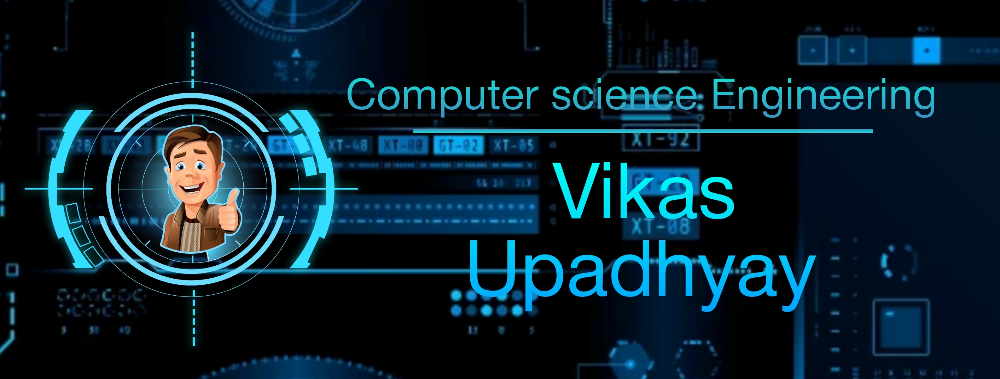

<h1 align="center">Hi 👋, I'm Vikas Upadhyay</h1>
<h3 align="center">A passionate frontend developer from India</h3>

<!---->

  

- 🌱 I’m currently learning **Gsap, React, Advance JS.**

- 👨‍💻 All of my projects are available at [https://vikasupadhyay.000webhostapp.com](https://vikasupadhyay.000webhostapp.com)

- 💬 Ask me about **Html,CSS, JS**

- 📫 How to reach me **vikas951743@gmail.com**

- 📄 Know about my experiences [https://drive.google.com/file/d/145mgtqxjnrUZ5SHC677sYWRX0lwCpj2R/view?usp=drivesdk](https://drive.google.com/file/d/145mgtqxjnrUZ5SHC677sYWRX0lwCpj2R/view?usp=drivesdk)

- ⚡ Fun fact **I think I am not a developer 😁**

<h3 align="left">Connect with me:</h3>

<h3 align="left">Languages and Tools:</h3>

         

&nbsp;

